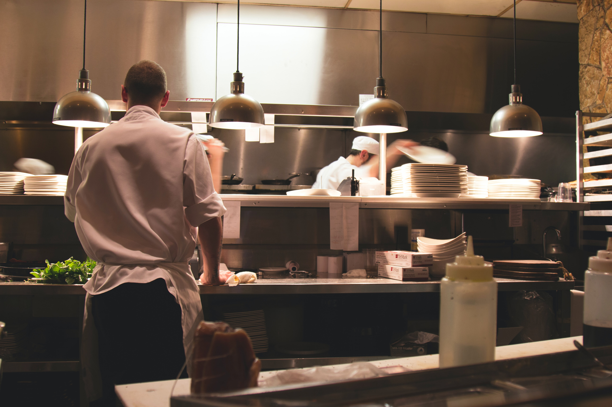
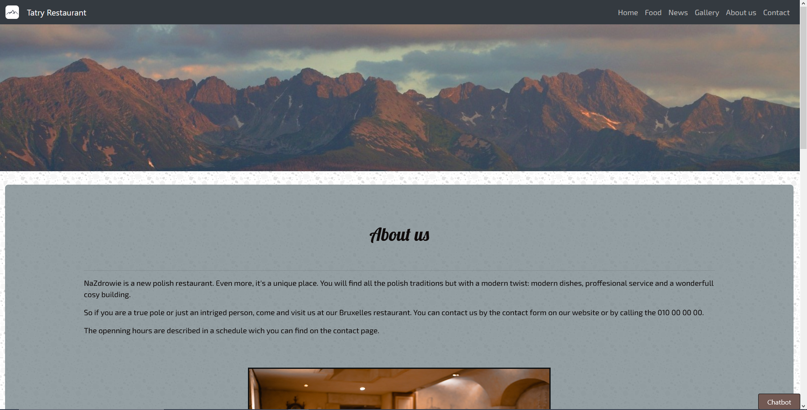
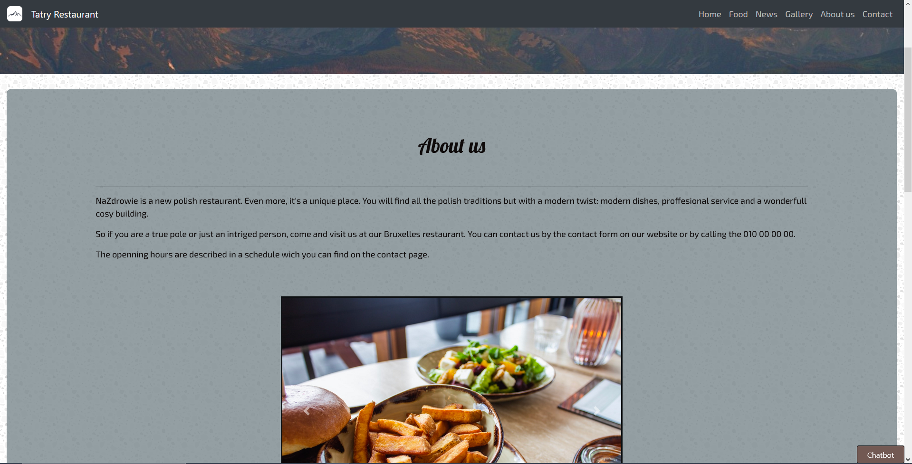
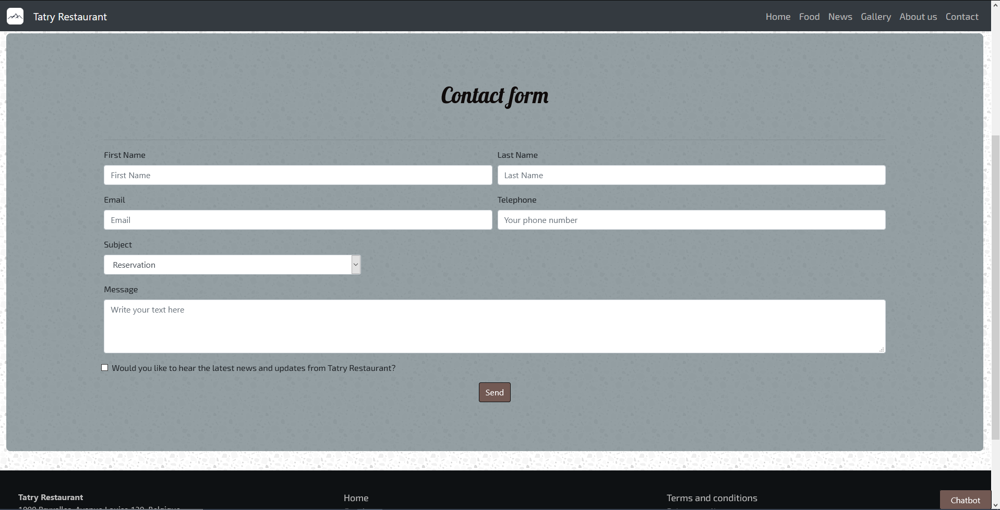

# Tatry Restaurant 👨‍🍳

## ◾ Project goals

<ul>
  <li>Tatry Restaurant is a fictitious static website made for a fictitious polish restaurant based in Bruxelles.</li>
  <li>The main goal is to give to the restaurant a better e-presence</li>
</ul>

  

## ◾ Features
<ul>
  <li>Homepage : contains a quick acces to the works sections, a covid-19 message and a caroussel with the latest achievements.</li>
  <li>About us: contains a short message from the owner as well as some links to the fake partners.</li>
  <li>Works: contains 4 sections wich regroup different achievements, each one has a description and a picture.</li>
  <li>Contact: contains one map and a contact form.</li>
</ul>

## ◾ Screenshots

### Homepage

  

### About us

  

### Works

  

### Contact

  

## ◾ Techs used

1. Front-end
   - [Pug](https://pugjs.org/api/getting-started.html)
   - [JavaScript](https://www.javascript.com/)
   - [Bootstrap](https://getbootstrap.com/)
   - [Sass](https://sass-lang.com/)
   
2. Others
   - [Node.js](https://nodejs.org/en/)

## ◾ Credits

[Mathieu Kruk](https://github.com/MathieuKruk)

## ◾ License

OpenSource | Free

  ✍️ Readme Author: 
  <a href="https://github.com/MathieuKruk">Mathieu Kruk</a>

  

